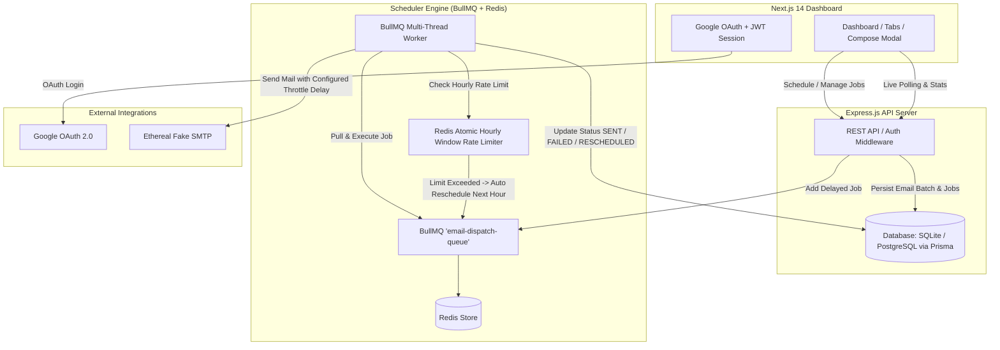

# 🚀 Pegion - Full-Stack Email Job Scheduler

Pegion is a production-grade, highly resilient email scheduler service and interactive dashboard built with **Node.js, Express, TypeScript, BullMQ, Redis, SQLite/PostgreSQL (via Prisma ORM), Nodemailer (Ethereal SMTP), Next.js 14, and Tailwind CSS**.

---

## 🎯 Architecture & Core Systems



### 1. How Scheduling Works (No Cron Jobs)
* **No Cron Libraries or OS crontabs**: Scheduling is entirely queue-driven using **BullMQ Delayed Jobs**.
* When a user schedules an email batch (either immediately or for a future date/time), the backend calculates the difference in milliseconds between the scheduled target time and the current system time:
  $$\text{delayMs} = \max(0, \text{targetTime} - \text{currentTime})$$
* The email job is added to the BullMQ queue with the calculated `delay` parameter. Redis registers this job in its zset scheduler, which fires the job at the exact moment the delay expires.

### 2. How Persistence on Restart is Handled
* **BullMQ Redis Backing**: Redis persistently stores the scheduled job metadata. If the Express backend server crashes or is restarted, the state of the queue in Redis is completely preserved.
* **Prisma Database Sync**: The database retains records of every email job and their exact states (`SCHEDULED`, `PROCESSING`, `SENT`, `FAILED`, `CANCELLED`, `RESCHEDULED`). 
* Upon server restart, the BullMQ worker simply reconnects to Redis and picks up right where it left off, referencing database records to prevent duplicate deliveries (idempotency checks).

### 3. How Rate Limiting & Concurrency are Implemented
* **Concurrency**: Workers run with a configurable concurrency parameter (`WORKER_CONCURRENCY`, default is `5`), meaning multiple email dispatches are processed in parallel on separate threads.
* **Throttling Delay**: A mandatory campaign-level throttle delay (`delaySeconds` between individual sends) is enforced using a sleep/delay function in the worker thread before mail dispatch.
* **Atomic Redis Hourly Rate Limiter**: 
  - Tracks sending usage globally per sender inside a UTC-based hourly bucket key in Redis:
    `email_rate_limit:{senderId}:{YYYY-MM-DD-HH}`
  - When the worker processes an email, it executes an atomic `INCR` in Redis.
  - If the incremented count exceeds the campaign's target hourly limit, the job is **not dropped or marked failed**.
  - Instead, the worker calculates the time remaining until the next UTC hour window opens, updates the database status to `RESCHEDULED`, and re-inserts the job into BullMQ with the calculated delay:
    $$\text{delayUntilNextWindowMs} = \text{nextHourTimestamp} - \text{currentTimestamp}$$
  - This preserves the execution order of the remaining emails in the queue.

---

## 🛠️ Environment Configuration & Ethereal Email Setup

### 1. Ethereal Email SMTP Integration
* This system integrates **Nodemailer** with **Ethereal Email** (a fake SMTP service for testing email deliveries).
* **Zero Configuration Needed**: The backend automatically provisions new test accounts from Ethereal on startup if custom SMTP keys are omitted.
* When emails are sent, the worker extracts the **Ethereal Message Preview URL** (`https://ethereal.email/message/...`) and persists it in the database. Users can click **"View Email"** in the dashboard to review the rendered template in their browser.

### 2. Environment Variables

Create a `.env` file in the `server/` directory:
```env
PORT=5001
NODE_ENV=development
DATABASE_URL="file:./dev.db" # SQLite local database path
REDIS_HOST=localhost
REDIS_PORT=6379
JWT_SECRET=reachinbox_super_secret_jwt_key_2026_scheduler
GOOGLE_CLIENT_ID=your-google-oauth-client-id.apps.googleusercontent.com
CLIENT_URL=http://localhost:3000
DEFAULT_DELAY_SECONDS=2
DEFAULT_HOURLY_LIMIT=200
WORKER_CONCURRENCY=5
```

Create a `.env.local` file in the `client/` directory:
```env
NEXT_PUBLIC_API_URL=http://localhost:5001/api
NEXT_PUBLIC_GOOGLE_CLIENT_ID=your-google-oauth-client-id.apps.googleusercontent.com
```

---

## 🚀 How to Run the Application

### Prerequisites
* **Node.js** (v18+ or v24+)
* **Redis** server running locally (`redis-server`) on default port `6379`
* **SQLite** (included by default, no setup required) or **PostgreSQL**

---

### Step 1: Install Dependencies
From the repository root directory, run:
```bash
npm run install:all
```
*(This installs root packages, server dependencies, and client packages).*

### Step 2: Database Migration
Deploy the SQLite database schema using Prisma:
```bash
cd server
npx prisma db push
cd ..
```

### Step 3: Run the Development Servers
Start both the Express Backend API & Next.js Frontend concurrently:
```bash
# Run from the root directory
npm run dev
```

* **Frontend Dashboard**: `http://localhost:3000` (or `http://localhost:3001` if port 3000 is occupied)
* **Backend REST API**: `http://localhost:5001`

---

## 🐳 Running via Docker Compose

To start Redis, Postgres, the API Server, and the Next.js Frontend inside containers:
```bash
docker-compose up --build
```

---

## ✨ Features Implemented

### 📦 Backend REST APIs & Queue Engine
* **Scheduler Engine**: Delayed queue system with BullMQ and Redis. No cron jobs used.
* **Persistent States**: Integrated with Prisma ORM and SQLite, tracking status changes.
* **Hourly Rate Limiter**: Redis-backed atomic limiter with automatic next-hour rescheduling.
* **Idempotency checks**: Double-check state in DB before processing to prevent duplicate dispatches.
* **Multi-tenant Auth Isolation**: Scopes statistics, sent campaigns, and scheduled tables to the currently logged-in user ID.
* **Interactive APIs**:
  - `POST /api/auth/google` (Real Google OAuth validation)
  - `POST /api/auth/demo` (1-click Sandbox Login)
  - `POST /api/emails/schedule` (Schedules campaign)
  - `GET /api/emails/scheduled` (Paginated, searched queued list)
  - `GET /api/emails/sent` (Paginated list of delivered and failed dispatches)
  - `DELETE /api/emails/:id` (Cancels scheduled jobs before dispatch with DB confirmation check)
  - `GET /api/stats` (Hourly rate limit metrics and dashboard totals)

### 🎨 Frontend Dashboard UI
* **Google OAuth Sign-In**: Real credential parsing alongside a sandbox 1-click **Demo Access** fallback.
* **ReachInbox-Inspired Premium Aesthetics**: Glassmorphic dark layout, custom animations, glowing accents, and responsive layout.
* **Lead CSV Parser**: Drag-and-drop file uploader that parses CSV and plain text files, extracting unique valid email addresses and displaying count badges.
* **Compose Campaign Panel**: Input fields for custom subjects, HTML email bodies, start times, throttle delay sliders, and hourly limits.
* **Live Refresh Statistics**: Stats cards dynamically poll count totals and current hour rate window usage (`current / limit`).
* **Interactive Tables**:
  - **Scheduled Emails**: View status indicators (`Scheduled`, `Processing`, `Rate-Limited`) and trigger cancel actions (protected by confirmation dialogs).
  - **Sent Emails**: View logs (`Delivered`, `Failed`) with direct **Ethereal Preview URL** buttons for instant validation.
